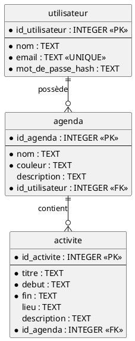
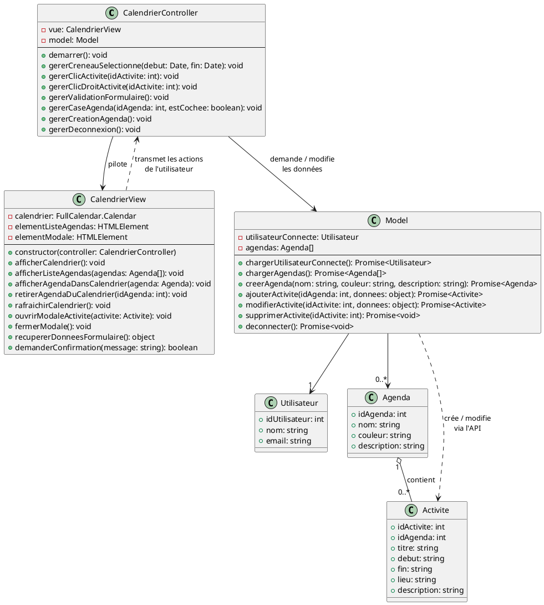
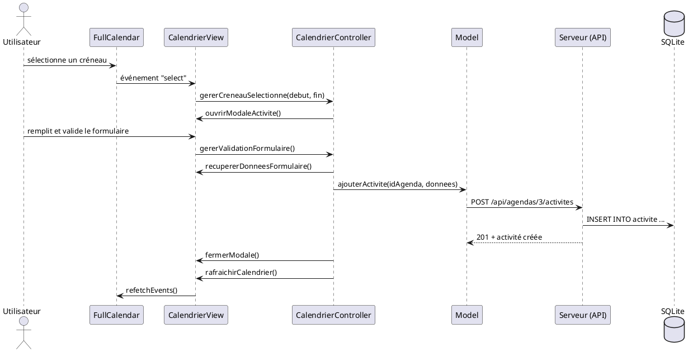

# Conception — Sprint 0

Ce document décrit la conception envisagée pour le sprint 0 :

1. le vocabulaire commun ;
2. le modèle de données (la base SQLite) ;
3. l'API (ce que le client demande au serveur) ;
4. l'architecture du client (pages et classes JavaScript) ;
5. ce qui est prévu pour les sprints suivants.

Les schémas sont écrits en PlantUML.

---

## 1. Vocabulaire

| Mot | Sens |
|---|---|
| **Utilisateur** | Une personne qui a un compte (email + mot de passe) |
| **Agenda** | Un ensemble d'activités, avec un nom et une couleur. Un utilisateur peut en avoir plusieurs (« Cours », « Sport »...) |
| **Activité** | Un événement placé dans un agenda, avec un début et une fin (le sujet parle de « rendez-vous ») |
| **Calendrier** | L'**affichage** (vue semaine, mois...) des activités des agendas cochés. Ce n'est pas une donnée |

Ces mots sont utilisés partout : tables, code, interface et issues.

---

## 2. Modèle de données



`*` = obligatoire (`NOT NULL`).

### Détail des tables

**utilisateur**

| Colonne | Type | Règle |
|---|---|---|
| `id_utilisateur` | INTEGER | Clé primaire, auto-incrémentée |
| `nom` | TEXT | Obligatoire. Nom affiché dans l'application |
| `email` | TEXT | Obligatoire, **unique**. Sert d'identifiant pour se connecter |
| `mot_de_passe_hash` | TEXT | Obligatoire. Le hachage est prévu au sprint de sécurité (#22) |

**agenda**

| Colonne | Type | Règle |
|---|---|---|
| `id_agenda` | INTEGER | Clé primaire, auto-incrémentée |
| `nom` | TEXT | Obligatoire |
| `couleur` | TEXT | Obligatoire. Format `#RRGGBB` (ex. `#3788d8`) |
| `description` | TEXT | Facultative |
| `id_utilisateur` | INTEGER | Obligatoire. Propriétaire de l'agenda. Supprimer l'utilisateur supprime ses agendas (`ON DELETE CASCADE`) |

**activite**

| Colonne | Type | Règle |
|---|---|---|
| `id_activite` | INTEGER | Clé primaire, auto-incrémentée |
| `titre` | TEXT | Obligatoire |
| `debut` | TEXT | Obligatoire. Date et heure au format ISO, en UTC : `2026-10-15T12:30:00Z` |
| `fin` | TEXT | Obligatoire. Même format. Règle : `fin > debut` (`CHECK`) |
| `lieu` | TEXT | Facultatif |
| `description` | TEXT | Facultative |
| `id_agenda` | INTEGER | Obligatoire. Supprimer l'agenda supprime ses activités (`ON DELETE CASCADE`) |

### Choix liés à SQLite

- **Dates en texte ISO, toujours en UTC** (format de `new Date().toISOString()`). Avec un format unique, le texte se trie et se compare comme une date : `WHERE debut < '2026-10-19'` fonctionne. Le navigateur affiche ensuite les heures dans le fuseau local (FullCalendar le fait tout seul).
- **Identifiants `INTEGER` auto-incrémentés** : SQLite les génère lui-même, rien à faire dans le code.
- Les tables sont créées par une **migration** (`database/migrations/001_...sql`), voir [docs/base-de-donnees.md](../../docs/base-de-donnees.md).

---

## 3. API

Toutes les routes commencent par `/api`. Le client et le serveur échangent du **JSON**.

Le serveur sait quel utilisateur est connecté grâce à une **session** (un cookie). Au sprint 0, c'est une ébauche ; la sécurisation (mots de passe hachés, routes réservées aux utilisateurs connectés) est prévue au sprint suivant (#22).

### Authentification

| Méthode | Route | Corps envoyé | Réponse |
|---|---|---|---|
| `POST` | `/api/auth/inscription` | `{ nom, email, motDePasse }` | `201` + l'utilisateur, ou `400` si l'email est déjà pris |
| `POST` | `/api/auth/connexion` | `{ email, motDePasse }` | `200` + l'utilisateur, ou `401` si identifiants incorrects |
| `POST` | `/api/auth/deconnexion` | — | `200` |
| `GET` | `/api/auth/moi` | — | `200` + l'utilisateur connecté, ou `401` si personne n'est connecté |

L'utilisateur renvoyé ne contient **jamais** le mot de passe : `{ idUtilisateur, nom, email }`.

### Agendas

| Méthode | Route | Corps envoyé | Réponse |
|---|---|---|---|
| `GET` | `/api/agendas` | — | `200` + la liste des agendas de l'utilisateur connecté |
| `POST` | `/api/agendas` | `{ nom, couleur, description }` | `201` + l'agenda créé |

### Activités

| Méthode | Route | Corps envoyé | Réponse |
|---|---|---|---|
| `GET` | `/api/agendas/:idAgenda/activites?start=...&end=...` | — | `200` + les activités de l'agenda qui chevauchent la période |
| `POST` | `/api/agendas/:idAgenda/activites` | `{ titre, debut, fin, lieu, description }` | `201` + l'activité créée |
| `PUT` | `/api/activites/:idActivite` | `{ titre, debut, fin, lieu, description }` | `200` + l'activité modifiée |
| `DELETE` | `/api/activites/:idActivite` | — | `204` |

- Les paramètres `start` et `end` portent ces noms parce que **FullCalendar les envoie lui-même** quand il change de semaine.
- Une activité « chevauche la période » si `debut < end` **et** `fin > start` (une activité de 23h à 1h apparaît bien sur les deux jours).
- Erreurs : `400` si un champ obligatoire manque ou si `fin <= debut`, `404` si l'agenda ou l'activité n'existe pas.

Format d'une activité renvoyée :

```json
{
    "idActivite": 12,
    "idAgenda": 3,
    "titre": "TD Intégration",
    "debut": "2026-10-15T08:00:00Z",
    "fin": "2026-10-15T10:00:00Z",
    "lieu": "Salle 204",
    "description": null
}
```

Côté serveur : un fichier de routes par ressource (`server/routes/auth.js`, `agendas.js`, `activites.js`), branché dans `server/server.js`.

---

## 4. Architecture du client

### Pages

| Page | Rôle |
|---|---|
| `connexion.html` | Formulaire de connexion, lien vers l'inscription |
| `inscription.html` | Formulaire d'inscription |
| `index.html` | Page principale : liste des agendas (avec cases à cocher) + calendrier. Redirige vers `connexion.html` si personne n'est connecté |

### Classes de la page principale (MVC)

L'affichage du calendrier (grille, semaine précédente / suivante, passage jour / semaine / mois) est **entièrement fait par FullCalendar**. Nos classes s'occupent seulement de nos données et de réagir aux actions de l'utilisateur.



**Rôle de chaque classe :**

- **Model** : seule classe qui parle au serveur (`fetch("/api/...")`). Elle garde en mémoire l'utilisateur connecté et sa liste d'agendas.
- **CalendrierView** : seule classe qui touche à la page (HTML) et à FullCalendar. Elle ne prend aucune décision : elle affiche, et elle transmet les actions de l'utilisateur au controller.
- **CalendrierController** : reçoit les actions (clic, sélection, case cochée...), demande au Model de modifier les données, puis demande à la View de se mettre à jour.
- **Utilisateur, Agenda, Activite** : les données, avec les mêmes champs que les tables de la base.

**Comment FullCalendar affiche plusieurs agendas :** chaque agenda coché est ajouté à FullCalendar comme une **source d'événements**. Cette source contient l'adresse `/api/agendas/:idAgenda/activites` et la couleur de l'agenda. Décocher un agenda retire sa source. FullCalendar demande alors lui-même les activités de la semaine affichée et les colore.

Les pages `connexion.html` et `inscription.html` sont simples : un petit script chacune, qui envoie le formulaire à l'API puis redirige vers `index.html`.

### Exemple : ajouter une activité



---

## 5. Prévu pour les sprints suivants

Ces éléments ne sont **pas** réalisés au sprint 0. Grâce aux migrations, ils s'ajouteront sans casser l'existant.

| Fonctionnalité | Conception envisagée |
|---|---|
| Sécurité (#22) | Mots de passe hachés, routes de l'API réservées aux utilisateurs connectés, vérification que l'agenda appartient bien à l'utilisateur |
| Partage d'agendas | Table de liaison `partage` (agenda, utilisateur, droit lecture / écriture) |
| Activités récurrentes | Stocker la **règle** de répétition (ex. « chaque lundi jusqu'au 15 décembre »), pas une copie de chaque activité |
| Recherche | Route `GET /api/activites/recherche?...` (pas de nouvelle table) |
| Import / export | Format à choisir (JSON ou iCalendar `.ics`), pas de nouvelle table |
